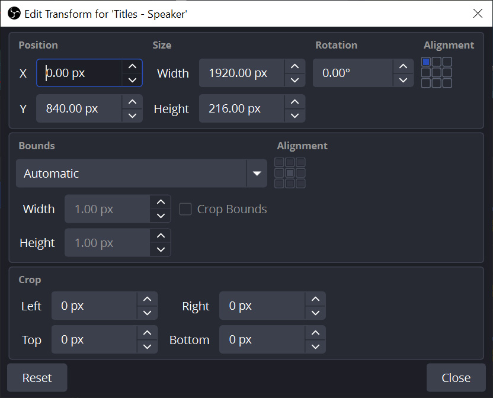
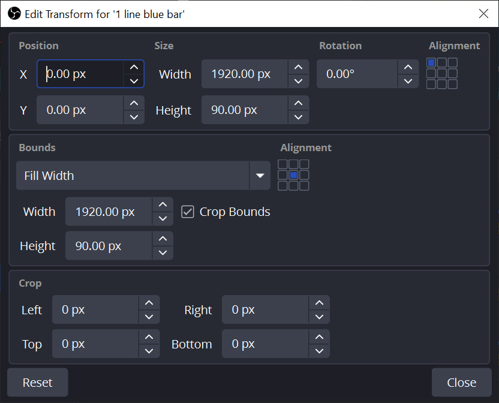

# Import OBS Settings to Windows 11 from Mac OS

## Prerequisites
This assumes you have already downloaded and installed the OBS application.

### Unzip the OBS settings file
This has all the scenes, profiles, assets, fonts, and other files needed.

### Install font files
Several custom font files are used for the titles and subtitles in the 
"lower-third" bar at the bottom for speaker names, hymns, and performances.

1. Go to each of the directories listed below under **\setup\Fonts**. 
2. Double-click the **.otf** or **.ttf** file to open it in the Windows Font Previewer.
3. Select **Install** to install it.

| Font                          | Directory                                | Use                                          |
| ----------------------------  | ---------------------------------------- | -------------------------------------------- |
| **BaskervaldADFTitleStd.otf** | \setup\Fonts\\**baskervald-adf-std-font** | name, hymn, song title                       |
| **KhulaTitle-regular.otf**    | \setup\Fonts\\**khula**                   | subtitle, song number and detail, performers |
| **Trajan Pro 3 Regular.otf**  | \setup\Fonts\\**Trajan Pro 3**            | welcome splash screen                        |
| **TrajanPro3Light.ttf**       | \setup\Fonts\\**TrajanPro3Light**         | welcome splash screen                        |

NOTE: if you don't install the fonts, the title text in the lower-third bar 
will not look right.

### Install Advanced Scene Switcher plugin
Download the latest version from the Internet and install it.

https://github.com/WarmUpTill/SceneSwitcher/releases

### Install Shaderfilter plugin
Make sure OBS is closed. Download the latest version from the Internet and 
install it.

https://github.com/exeldro/obs-shaderfilter/releases

### Install VB Cable driver
Install it from the setup/Audio/VBCABLE_Driver_Pack43 directory. The saved 
OBS profiles expect to route audio (monitor ouptupt) to the VBCable virtual 
cable which you can input to other applications like Zoom.

Download the latest from here:

https://vb-audio.com/Cable/

### Install PTZ Controller app from PTZOptics
This is not necessary but is a convenient way to control a PTZ camera from 
the desktop.

Install it from the setup/PTZControl/PTZOptics PTZ Controller Windows 1.4.1.zip file. 

Download the latest desktop controller from here:

https://docs.ptzoptics.com/apps/legacy-apps/

Download the OBS plugin from here:

https://github.com/PTZOptics/OBSPlugin

There are other plugins and desktop controllers you can use instead.

## 1 Copy unzipped file directory
Copy OBS directory to the root, C:\, so the directory is C:\OBS

Overwrite all files. If you don't want to lose anything, move or  copy the 
existing C:\OBS directory somewhere else.

## 2 Edit the scene .json file
Edit the scene(s) .json file(s) under the \scenes\ directories.

### Replace directory paths
Search for "/Users/{username}" and replace with "C:"

For example, search for:

**/Users/LukeS** 

and replace with:

**C:**
 
Make sure all **/OBS/...** paths are prefixed with **C:/**

For example:

`C:/OBS/scenes/Sacrament-HD/images/BottomThirds-HD-BlueBar-880y-135h.png`

If they are not prefixed with C:/ then search and replace the prefix directory 
path with C:/ so it looks like the example above and save the file.
   
**Note:** on Mac OS and Windows, OBS uses slashes (/) for file paths, which is the 
convention on all Linux and Mac operating systems, instead of backslashes (\\), 
which is the convention on Windows operating systems. OBS for Windows recognizes 
slashes (/) even though the OS uses the backslash (\\) convention. DO NOT USE 
BACKSLASHES (\\) IN FILE PATHS IN THE OBS JSON SETTINGS FILES.

### Replace directory path for shader_file_name
In the scene .json file, search for **shader_file_name** and change the directory 
path to match where the shader filter is on Windows.
   
#### Mac OS
```
/Users/{username}/Library/Application Support/obs-studio/plugins/obs-shaderfilter.plugin/Contents/Resources/examples/drop_shadow.shader
```

#### Windows 11
```
C:/Program Files/obs-studio/data/obs-plugins/obs-shaderfilter/examples/drop_shadow.shader
```

## 3 Edit basic.ini file
Edit the **basic.ini** under the **scenes/profile/{scene name}** directory

Make sure all file paths are prefixed with **C:\\\\** and point to valid
directories, for example:

```
FilePath=C:\\Users\\myUser\\Videos\\OBS
RecFilePath=C:\\Users\\myUser\\Videos\\OBS
FFFilePath=C:\\Users\\myUser\\Videos\\OBS
```

**Note:** Unlike the JSON file, the file paths in basic.ini use double 
backslashes (\\\\). 

## 4 Import Scene Collection
If you already have the Scene Collection in OBS, open OBS and delete the Scene 
Collection that will be replaced.

1. Go to Scene Collection > Import.
2. Under Collection Path, click on the 3 dots.
3. Find the .json file for that scene under the OBS/scenes directory.
4. Click on Open to add it to the import list.
5. Click on Import.

Switch to the imported Scene Collection to verify that all the scenes work. Go 
to Scene Collection and select the imported scene collection. If there are 
missing files, a message will display showing what is missing.

_Many of the settings exported from Mac OS don't import properly into Windows 11.
They will have to be fixed manually._

For example, the **Slide Show of Pictures** scene usually doesn't retain the path 
of the directory for the pictures in the slide show. A message will display that
says "_Some files are missing since you last used OBS_" and show the Source with 
the problem and will automatically go to the scene.

### Fix Missing Files
Switch to the imported scene. If it shows a missing file or directory, go to the 
Source in the Scene and reselect the file or directory.

Many of the captions may not display because the path and name of the files that 
have the caption text aren't retained. These usually aren't reported as missing 
files. You will have to go through the scenes with captions. If the text doesn't 
display, reselect the file.

### Check for Broken Sources
The video, audio, image, and media source options are different between Mac OS 
and Windows. Invalid sources will be red.

Click on every scene and note the ones that have invalid sources.

#### Fix Broken Video Source
1. Go to a scene, Add Source, select Video Capture Device.
2. Copy the name of the old source.
3. Rename the old source with "-old" on the end.
4. Rename the new source with the copied name.
5. Check the old source for filters. If there are any, recreate them on the new source.
6. Copy the new source (Ctrl+C) to all the scenes that use it and paste it (Ctrl+V) as a reference.
7. Move it to the same place in the scene as the old source.
8. Delete the old source from the scene.

## 5 Import Profile
If you already have the Profile in OBS, open OBS and delete the Profile 
that will be replaced.

Import the Profile by going to Profile > Import and finding the Profile
directory under OBS/scenes/(scene name)/profile.

NOTE: if you put the OBS directory somewhere other than the root, C:/, follow
the same instructions in steps 4 and 5 and replace the root path.

### Title Fonts

#### Titles Group
Start with **Reset Transform (Ctrl+R)**, which will move the titles group to 
the top left of the screen. To move it back down to the bottom left, 
**Edit Transform (Ctrl+E)** and use the values below.

**Tip:** When moving sources in or out of a Group, the transform settings can get 
messed up. Select the source and **Reset Transform (Ctrl+R)** to clean up.



| Pos X | Pos Y  | Width   | Height | Bounds    | Width  | Height |
| ----: | -----: | ------: | -----: | --------- | -----: | -----: |
| 0 px  | 840 px | 1920 px | 216 px | Automatic | (1 px) | (1 px) |

Height is 216 px to accommodate up to 4 lines of titles; for example:

A Poor Wayfaring Man of Grief\
HYMN 29\
Text: James Montgomery, 1771–1854\
Music: George Coles, 1792–1858

**Note:** Because the bounds are automatic, the height and vertical position 
of the lines will change as you edit the transform on the text and blue bars. 
When you're done doing all the sources in the group, the height may have 
increased to something like 224.31. Come back to the group and set the height 
back to 216.

#### Title (Mac OS)
Here are the Edit Transform settings (Ctrl+E).

|            | Font                     | Size  | X Pos  | Y Pos  | Height |
| ---------- | ------------------------ | ----: | -----: | -----: | -----: |
| Title      | Baskervald ADF Title Std | 56 pt | 112 px | 3 px   | 55 px  |
| Subtitle   | Khula Title              | 32 pt | 112 px | 78 px  | 30 px  |

#### Title (Windows)
Here are the Edit Transform settings (Ctrl+E).

|            | Font                     | Size  | X Pos  | Y Pos  | Height  |
| ---------- | ------------------------ | ----: | -----: | -----: | ------: |
| Title      | Baskervald ADF Title Std | 72 pt | 112 px | 16 px  | 72 px   |
| Subtitle   | Khula Title Regular      | 43 pt | 112 px | 81 px  | 130 px  |

In the Properties for the text:
1. Set Outline
2. Outline Size: 1
3. Outline Color: #00000000 (black)

This smooths out pixelated borders on the text due to the dropdown shadow filter. 

#### Title Filters for Drop Shadow on Text (Windows)
1. Select the title and go to **Filters**
2. Add a **User-defined shaders**.
3. Navigate to C:/Program Files/obs-studio/data/obs-plugins/obs-shaderfilter/examples/ 
4. Select the **drop_shadow.shader**.
5. Name the filter **Drop Shadow Shader**.
6. Use the settings below.

|           | Shader             | Offset X | Offset Y | Blur Size | Color      |
| --------- | -------------------| -------: | -------: | --------: | ---------: |
| Title     | drop_shadow.shader | 3 px     | 3 px     | 3 px      | #00000000  |
| Subtitle  | drop_shadow.shader | 3 px     | 3 px     | 3 px      | #00000000  |

**Note:** if the drop shadow doesn't show, check that the **Shaderfilter plugin** 
is installed. If it is, the shader file probably isn't found. Reselect it (steps 3 
and 4).

#### Blue Bar Under Titles (Windows) (880)
This is a Color source with color **#003058** (dark blue) and an 
**Image Mask/Blend** filter set to 0.9000 (90% opaque) using a 
full screen image fade from left to right, **Mask-50pct-fade-left-right-4k.jpg**.




Here are the Edit Transform settings (Ctrl+E).

**Note:** If there are any Crop values set, like Bottom: 1000px, reset them to 0.

| Color Name      | Pos X | Pos Y | Width   | Height | Bounds     | Width   | Height | Note        |
| --------------- | ----: | ----: | ------: | -----: | ---------- | -----:  | -----: | ----------- |
| 1 Line Blue Bar | 0 px  | 0 px  | 1920 px |  90 px | Fill Width | 1920 px |  90 px | Crop Bounds |
| 2 Line Blue Bar | 0 px  | 0 px  | 1920 px | 132 px | Fill Width | 1920 px | 132 px | Crop Bounds |
| 3 Line Blue Bar | 0 px  | 0 px  | 1920 px | 176 px | Fill Width | 1920 px | 176 px | Crop Bounds |
| 4 Line Blue Bar | 0 px  | 0 px  | 1920 px | 216 px | Fill Width | 1920 px | 216 px | Crop Bounds |


### Picture-in-Picture Scenes
Edit Transform (Ctrl+E) and use these settings. The PIP window is 1/8th of the 
screen size.

| Group Name      | X Pos    | Y Pos  | Width  | Height |
| --------------- | -------: | -----: | -----: | -----: |
| PIP Upper Left  | 10 px    | 10 px  | 480 px | 270 px |
| PIP Upper Right | 1430 px  | 10 px  | 480 px | 270 px |
| PIP Lower Left  | 10 px    | 800 px | 480 px | 270 px |
| PIP Lower Right | 1430 px  | 800 px | 480 px | 270 px |

After fixing the groups in one scene, select all 4 and Copy (Ctrl+C) them.
Go to the other scenes that use the same PIP groups and first delete the 
existing ones, then Paste (Ctrl+V) the ones you copied.